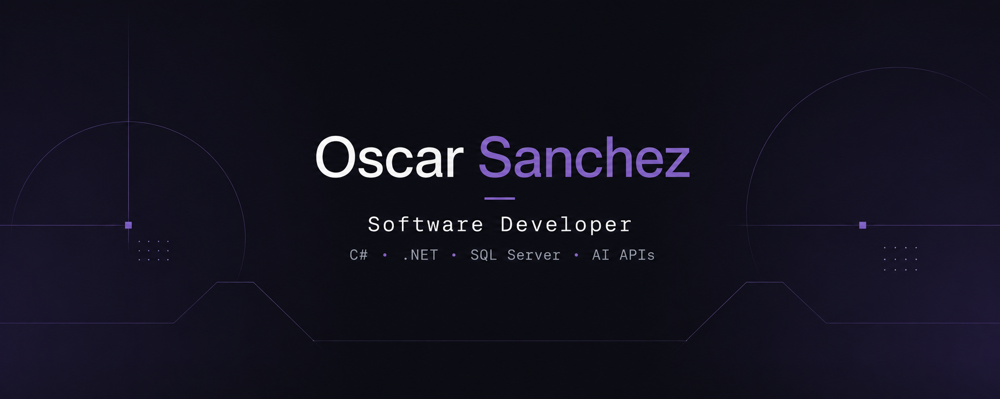

<h1 align="center">Hi, I'm Oscar Sanchez 👋</h1>

<h3 align="center">
  Software Developer · C# / .NET · Backend · Automation · AI
</h3>

<p align="center">
  <a href="https://www.linkedin.com/in/oscardaniel028/">
    
  </a>
</p>

<p align="center">
  
</p>

---

## 👨‍💻 About Me

I'm a Software Developer from **Bogotá, Colombia**, primarily focused on **C# and the .NET ecosystem**.

I build backend systems, automation solutions, REST APIs, and AI-powered applications, with a strong interest in **software architecture, scalability, performance, and maintainable code**.

I enjoy solving real-world problems with software and understanding the engineering decisions behind a solution — not just making it work, but making it easier to maintain, evolve, and scale.

I'm continuously growing my skills in **system design, distributed systems, cloud technologies, and AI engineering**.

---

## 🧰 Tech Stack

### Backend

<p>
  
  
</p>

`C#` · `.NET` · `ASP.NET Core` · `REST APIs` · `Entity Framework Core` · `LINQ` · `Hangfire` · `JWT` · `Clean Architecture`

### Databases & Caching

<p>
  
  
  
  
</p>

`SQL Server` · `PostgreSQL` · `MongoDB` · `Redis` · `Database Design` · `Query Optimization`

### Frontend

<p>
  
  
  
  
</p>

`Angular` · `Next.js` · `TypeScript` · `JavaScript` · `HTML` · `CSS` · `Tailwind CSS`

### Cloud, DevOps & Tools

<p>
  
  
  
  
  
</p>

`Azure` · `Docker` · `Git` · `GitHub` · `Azure Repos` · `Visual Studio` · `VS Code`

### Automation & AI

`Python` · `Selenium` · `Playwright` · `RPA` · `AI APIs` · `LLM Integrations` · `Prompt Engineering` · `Data Processing`

---

## 🏗️ What I Work On

My work is mainly centered around building and improving software solutions involving:

* Backend development with C# and .NET
* RESTful API design and development
* Database-driven applications
* Automation and RPA
* Background processing and asynchronous workflows
* AI and LLM API integrations
* Performance and scalability
* Software architecture and maintainability

I particularly enjoy working on problems where **software, automation, and AI intersect**.

---

## 🧠 Currently Learning & Exploring

I'm continuously deepening my knowledge in:

* Software Architecture
* System Design
* Distributed Systems
* Scalability & Performance
* C# / .NET internals
* SQL optimization
* Entity Framework Core
* Caching & Redis
* Automated Testing
* Azure
* AI Engineering
* AI-powered software products

> I believe becoming a better developer isn't about knowing every technology — it's about understanding **why, when, and how to use the right one**.

---

## 🔧 Engineering Principles

I value:

* Clean and readable code
* Meaningful abstractions
* Maintainability
* Simplicity over unnecessary complexity
* Performance where it matters
* Clear separation of responsibilities
* Reliable and testable systems
* Continuous learning

My approach is simple:

```text
Understand the problem
        ↓
Design the solution
        ↓
Build with intention
        ↓
Keep it maintainable
        ↓
Improve continuously
```

---

## 📫 Let's Connect

I'm always interested in connecting with developers, engineers, and people working on interesting software products.

<p>
  <a href="https://www.linkedin.com/in/oscardaniel028/">
    
  </a>
</p>

<p align="center">
  <i>Building software, learning continuously, and solving problems one system at a time.</i>
</p>
